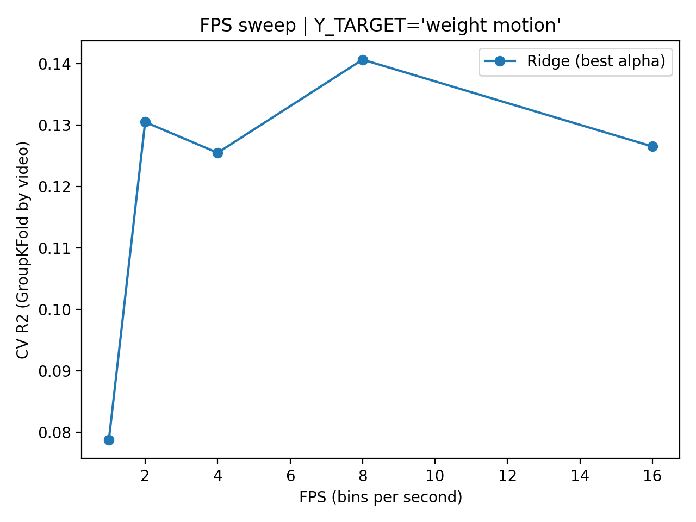
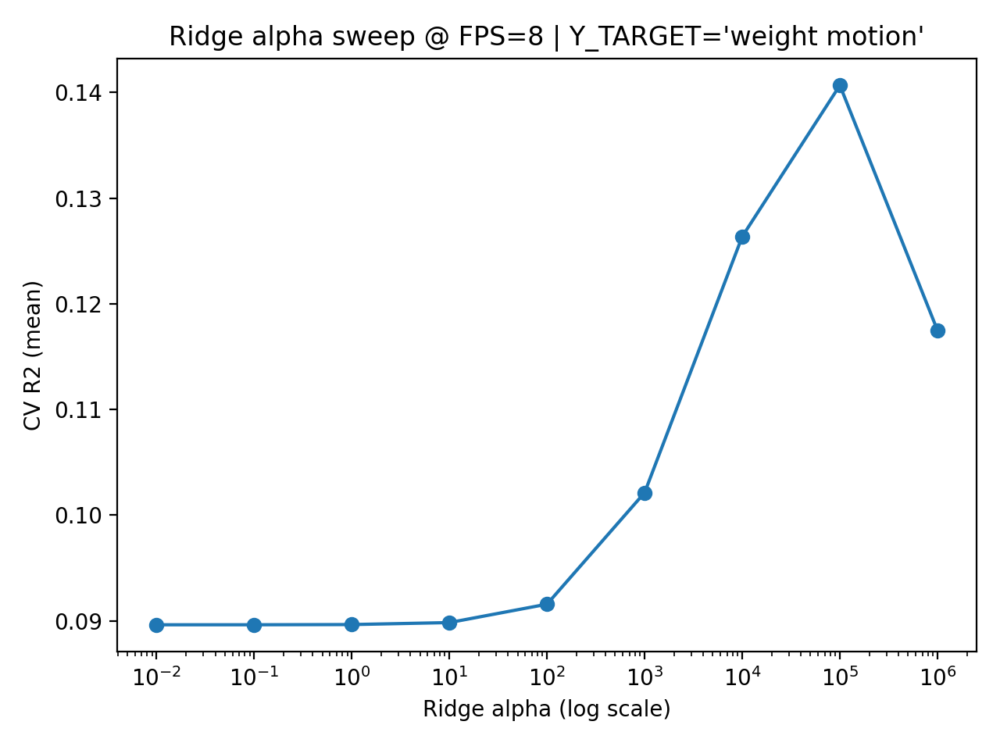
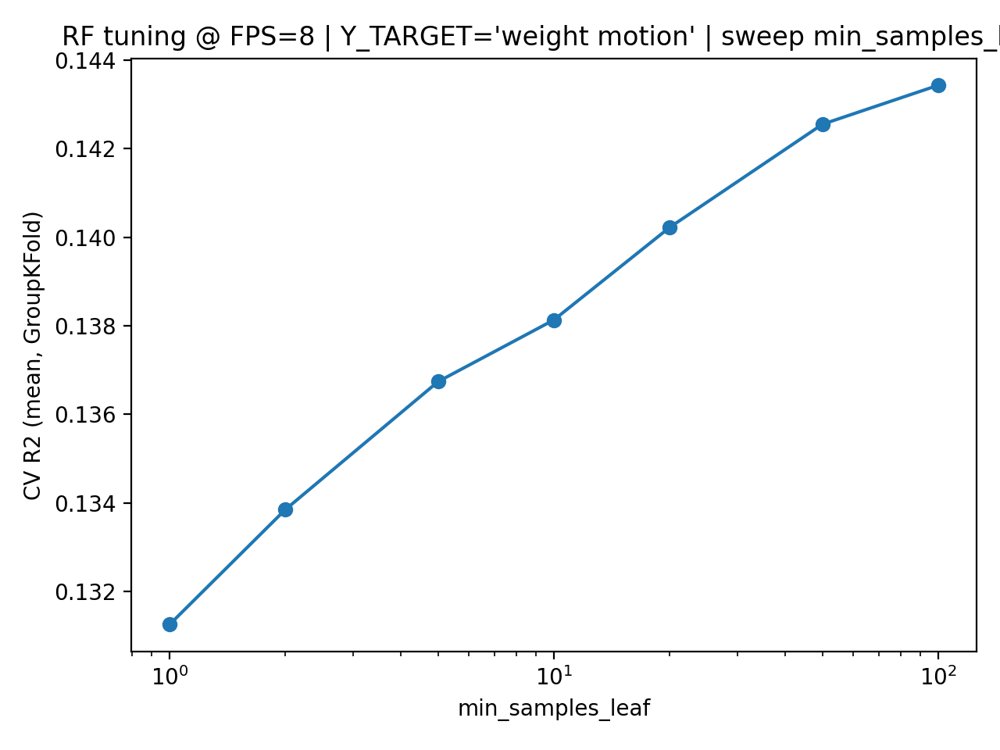
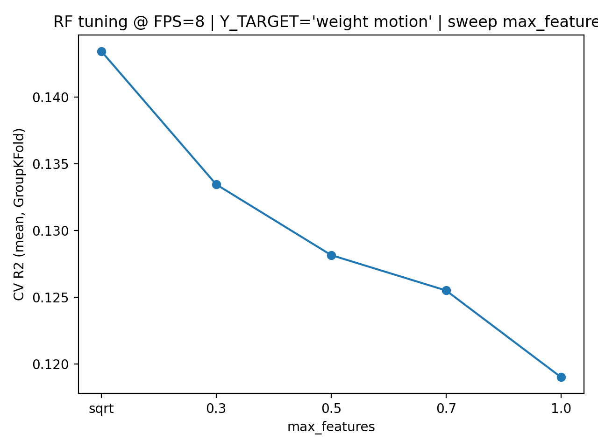
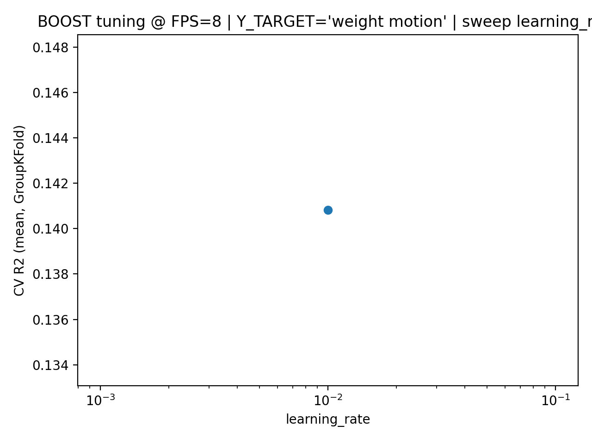
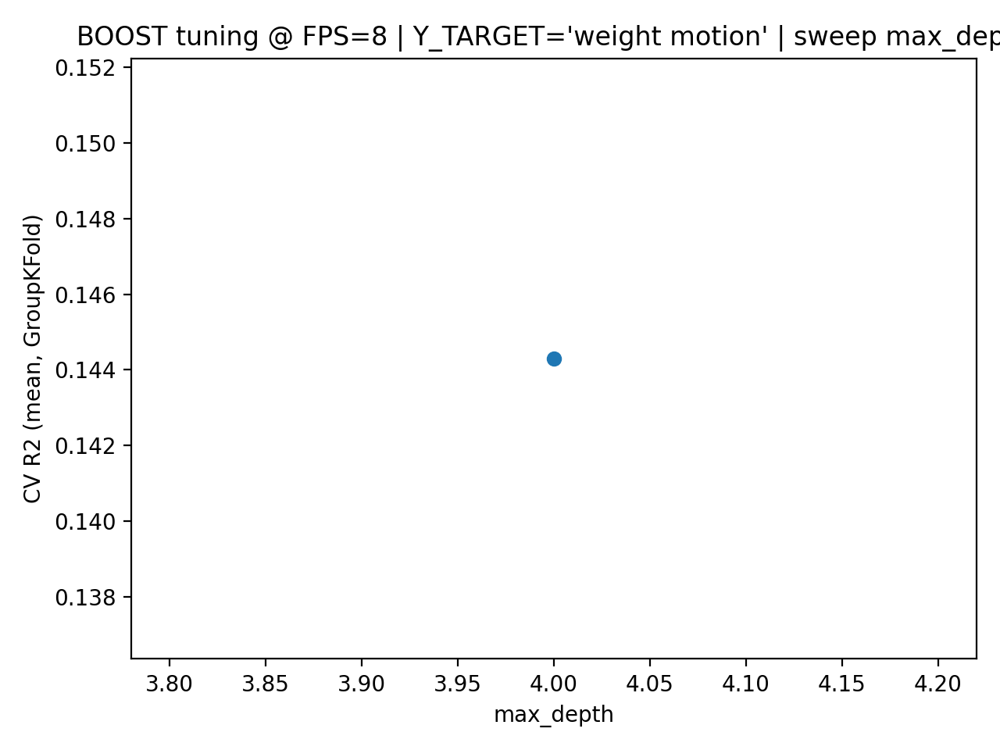
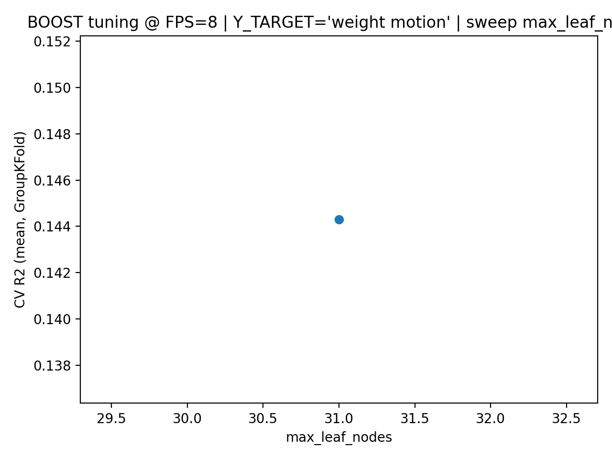
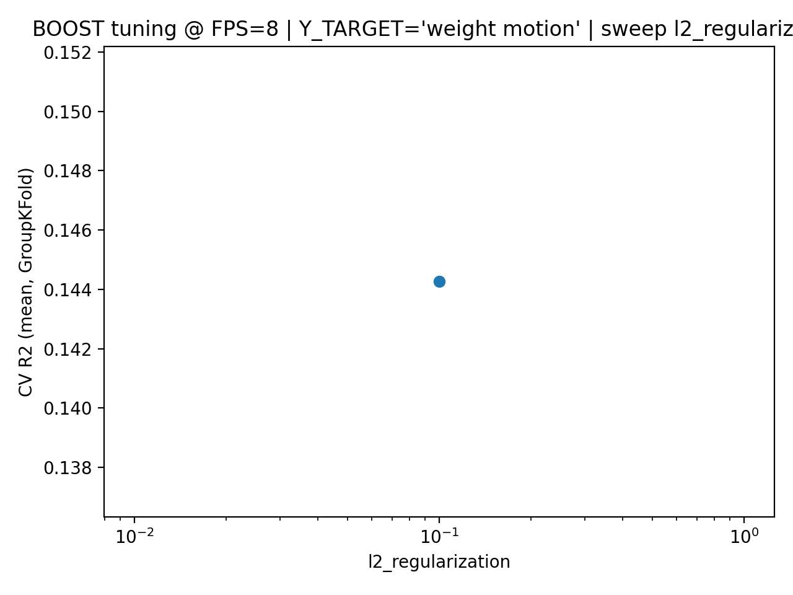

# Cross-Modal Learning in Music Visualizers

**Morris Blaustein** — Department of Statistics, Purdue University
*Statistical Machine Learning Project*

---

Music visualizers create immersive experiences by exploiting correlations between sound and visual structure. This project applies cross-modal learning to map audio features to compact visual descriptors derived from video frames, enabling a real-time audio-driven visualizer that generates correlated visuals via TouchDesigner.

---

## Overview

Rather than predicting artistic properties like color (which are subjective and inconsistent), this work focuses on two perceptually grounded visual targets:

- **Motion** — frame-to-frame change in pixel content (visual activity)
- **Weight** — dominance of the primary color cluster in a frame (visual uniformity)

Three regression models — Ridge, Random Forest, and Gradient Boosting — are trained with **GroupKFold cross-validation** across multiple temporal resolutions (1–16 FPS). The best-performing configuration (8 FPS) is used to predict control signals fed into a TouchDesigner music visualizer.

---

## Pipeline

```
YouTube Playlists
      │
      ▼
extract_audio.py / extract_song.py     ← download & resample audio (22,500 Hz)
extract_colors.py                      ← extract visual targets per frame
export_controls_to_csv.py             ← export frame-level controls
      │
      ▼
prep_data.py                           ← align audio/video, build .npz datasets
      │                                   at 1, 2, 4, 8, 16 FPS
      ▼
run_sweeps.py                          ← train Ridge / RF / Boosting models,
                                          sweep FPS & hyperparameters, save plots
      │
      ▼
TouchDesigner                          ← real-time visualizer driven by
                                          predicted weight & motion signals
```

---

## Dataset & Features

**Source:** Public YouTube music visualizer playlists (downloaded via Pytube, standardized with FFmpeg)

**Audio features (66 per frame):**
| Feature | Dim | Description |
|---|---|---|
| Mel-spectrogram | 64 | Perceptual frequency content |
| RMS energy | 1 | Overall signal strength |
| Onset strength | 1 | Transient / rhythmic activity |

**Visual targets (2 per frame):**
| Target | Description |
|---|---|
| Motion | Mean pixel difference between consecutive frames |
| Weight | Fraction of pixels in the dominant color cluster |

Color-based targets (hue, saturation, value) were tested but consistently yielded near-zero or negative R², confirming that color in music visualizers is an artistic choice, not a statistically learnable response to audio.

---

## Models

| Model | Notes |
|---|---|
| **Ridge Regression** | ℓ₂-regularized OLS; baseline linear model |
| **Random Forest** | Ensemble of decision trees; captures non-linear interactions |
| **Gradient Boosting** | `HistGradientBoostingRegressor`; histogram-based boosting |

All models trained with **GroupKFold (k=5)**, grouping by video to prevent temporal leakage and ensure generalization to unseen visual sequences.

---

## Results

### Frame Rate Sweep

Performance peaks at **8 FPS**, striking the best balance between temporal context and frame redundancy. Beyond 8 FPS, adjacent frames become increasingly redundant, slightly hurting generalization.



### Best Model Performance at 8 FPS

| Model | R² mean | R² std | RMSE mean |
|---|---|---|---|
| Ridge | 0.141 | 0.085 | 0.114 |
| **Random Forest** | **0.143** | **0.089** | **0.114** |
| Boosting | 0.083 | 0.097 | 0.117 |

Motion is consistently more predictable than weight; color targets yielded R² ≈ −0.98 to −0.11, confirming they are not learnable from audio alone.

---

### Hyperparameter Tuning at 8 FPS

#### Ridge — ℓ₂ Regularization Sweep

Stronger regularization improves generalization, consistent with the high-dimensional (66-feature) audio input space.



---

#### Random Forest — Minimum Samples per Leaf

Larger leaf sizes reduce overfitting in the high-dimensional feature space.



#### Random Forest — Max Features per Split

Restricting features per split (`sqrt`) improves generalization by decorrelating trees.



---

#### Gradient Boosting — Learning Rate

Lower learning rates yield more stable generalization; high rates cause rapid performance degradation.



#### Gradient Boosting — Max Tree Depth

Moderate depths (4–5) perform best; deeper trees offer no benefit and reduce generalization.



#### Gradient Boosting — Max Leaf Nodes

Performance saturates quickly, suggesting simple tree structures are sufficient.



#### Gradient Boosting — ℓ₂ Regularization

Performance is relatively insensitive to ℓ₂ regularization within the tested range.



---

## Key Findings

- **Motion > Weight > Color** in predictability from audio features
- **8 FPS** is the optimal temporal resolution for audio-visual alignment
- **Linear models are competitive** — increased model complexity (boosting) does not substantially improve performance, suggesting the audio-visual relationship is weak and approximately linear
- **Color is an artistic choice**, not a statistically learnable audio response — prior work emphasizing color as a primary visual encoder does not generalize statistically

---

## Code

| File | Description |
|---|---|
| `extract_audio.py` | Download and resample audio from YouTube |
| `extract_song.py` | Extract audio features (mel-spectrogram, RMS, onset) |
| `extract_colors.py` | Extract visual targets (motion, weight) per frame |
| `export_controls_to_csv.py` | Export predicted controls for TouchDesigner |
| `prep_data.py` | Align audio/video data and build `.npz` datasets |
| `train_linear_split_cv.py` | Ridge regression training with cross-validation |
| `train_random_forrest.py` | Random forest training with cross-validation |
| `train_boost.py` | Gradient boosting training with cross-validation |
| `run_sweeps.py` | Full FPS and hyperparameter sweep pipeline |

---

## References

Lima, H. B., dos Santos, C. G. R., & Meiguins, B. S. (2021). A survey of music visualization techniques. *ACM Computing Surveys*, 54(7), 143:1–143:29.
